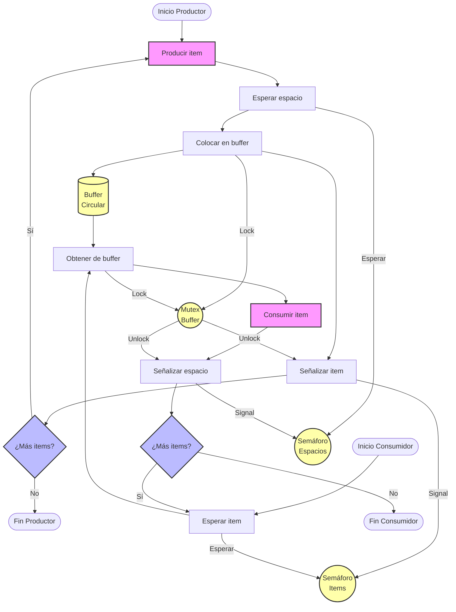

# Diagrama de Flujo: Productor-Consumidor

```mermaid
graph TD
    %% Estados Productor
    PSTART([Inicio Productor])
    PROD[Producir item]
    WAIT_P[Esperar espacio]
    PUT[Colocar en buffer]
    PSIG[Señalizar item]
    PEND([Fin Productor])

    %% Estados Consumidor
    CSTART([Inicio Consumidor])
    WAIT_C[Esperar item]
    GET[Obtener de buffer]
    CONS[Consumir item]
    CSIG[Señalizar espacio]
    CEND([Fin Consumidor])

    %% Decisiones
    P_CHK{¿Más items?}
    C_CHK{¿Más items?}

    %% Buffer compartido
    BUFFER[(Buffer<br/>Circular)]

    %% Flujo Productor
    PSTART --> PROD
    PROD --> WAIT_P
    WAIT_P --> PUT
    PUT --> PSIG
    PSIG --> P_CHK
    P_CHK -- Sí --> PROD
    P_CHK -- No --> PEND

    %% Flujo Consumidor
    CSTART --> WAIT_C
    WAIT_C --> GET
    GET --> CONS
    CONS --> CSIG
    CSIG --> C_CHK
    C_CHK -- Sí --> WAIT_C
    C_CHK -- No --> CEND

    %% Interacciones con Buffer
    PUT --> BUFFER
    BUFFER --> GET

    %% Control de concurrencia
    SEM_EMPTY((Semáforo<br/>Espacios))
    SEM_FULL((Semáforo<br/>Items))
    MUTEX((Mutex<br/>Buffer))

    WAIT_P -- Esperar --> SEM_EMPTY
    PUT -- Lock --> MUTEX
    MUTEX -- Unlock --> PSIG
    PSIG -- Signal --> SEM_FULL


    WAIT_C -- Esperar --> SEM_FULL
    GET -- Lock --> MUTEX
    MUTEX -- Unlock --> CSIG
    CSIG -- Signal --> SEM_EMPTY

    %% Estilo
    classDef process fill:#f9f,stroke:#333,stroke-width:2px
    classDef decision fill:#bbf,stroke:#333,stroke-width:2px
    classDef resource fill:#ffa,stroke:#333,stroke-width:2px
    class PROD,CONS process
    class P_CHK,C_CHK decision
    class BUFFER,SEM_EMPTY,SEM_FULL,MUTEX resource
```