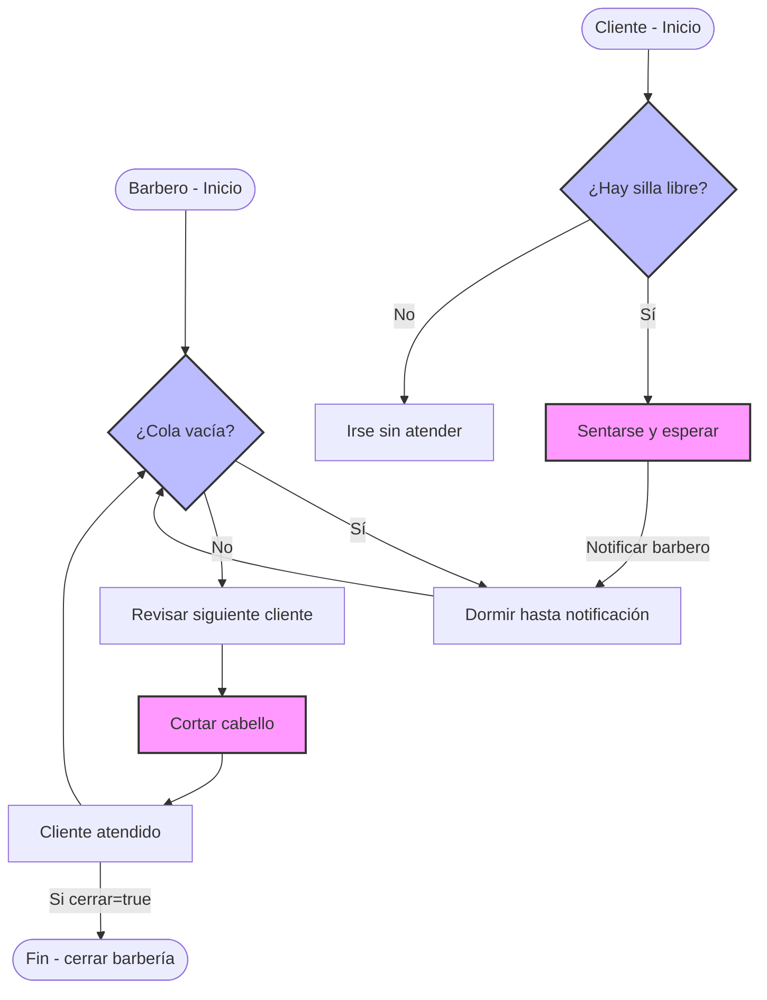

# Diagrama de Flujo: Barbero Dormilón

```mermaid
graph TD
    %% Inicio barbero
    B_START([Barbero - Inicio])
    B_SLEEP{¿Cola vacía?}
    B_WAIT[Dormir hasta notificación]
    B_CHECK[Revisar siguiente cliente]
    B_CUT[Cortar cabello]
    B_DONE[Cliente atendido]
    B_END([Fin - cerrar barbería])

    %% Inicio cliente
    C_START([Cliente - Inicio])
    C_CHECK{¿Hay silla libre?}
    C_WAIT[Sentarse y esperar]
    C_LEAVE[Irse sin atender]

    %% Flujo barbero
    B_START --> B_SLEEP
    B_SLEEP -- Sí --> B_WAIT
    B_SLEEP -- No --> B_CHECK
    B_WAIT --> B_SLEEP
    B_CHECK --> B_CUT
    B_CUT --> B_DONE
    B_DONE --> B_SLEEP
    B_DONE -- Si cerrar=true --> B_END

    %% Flujo cliente
    C_START --> C_CHECK
    C_CHECK -- Sí --> C_WAIT
    C_CHECK -- No --> C_LEAVE
    C_WAIT -- Notificar barbero --> B_WAIT

    %% Estilo
    classDef process fill:#f9f,stroke:#333,stroke-width:2px
    classDef decision fill:#bbf,stroke:#333,stroke-width:2px
    class B_SLEEP,C_CHECK decision
    class B_CUT,C_WAIT process
```