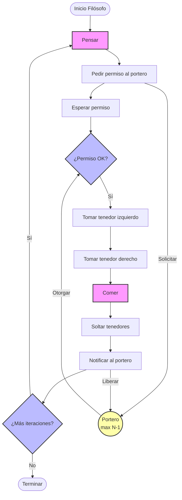

# Diagrama de Flujo: Cena de los Filósofos

```mermaid
graph TD
    %% Estados filósofo
    START([Inicio Filósofo])
    THINK[Pensar]
    REQ[Pedir permiso al portero]
    WAIT[Esperar permiso]
    TAKE_L[Tomar tenedor izquierdo]
    TAKE_R[Tomar tenedor derecho]
    EAT[Comer]
    REL[Soltar tenedores]
    NOTIFY[Notificar al portero]
    END([Terminar])

    %% Decisiones
    CHK_ITER{¿Más iteraciones?}
    CHK_PERM{¿Permiso OK?}

    %% Flujo principal
    START --> THINK
    THINK --> REQ
    REQ --> WAIT
    WAIT --> CHK_PERM
    CHK_PERM -- Sí --> TAKE_L
    TAKE_L --> TAKE_R
    TAKE_R --> EAT
    EAT --> REL
    REL --> NOTIFY
    NOTIFY --> CHK_ITER
    CHK_ITER -- Sí --> THINK
    CHK_ITER -- No --> END

    %% Control de concurrencia
    PORTERO((Portero<br/>max N-1))
    REQ -- Solicitar --> PORTERO
    NOTIFY -- Liberar --> PORTERO
    PORTERO -- Otorgar --> CHK_PERM

    %% Estilo
    classDef process fill:#f9f,stroke:#333,stroke-width:2px
    classDef decision fill:#bbf,stroke:#333,stroke-width:2px
    classDef resource fill:#ffa,stroke:#333,stroke-width:2px
    class THINK,EAT process
    class CHK_ITER,CHK_PERM decision
    class PORTERO resource
```